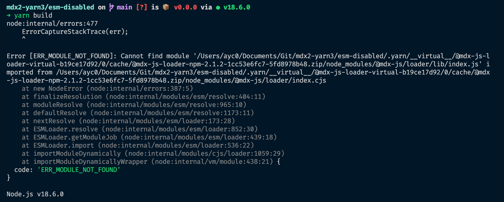
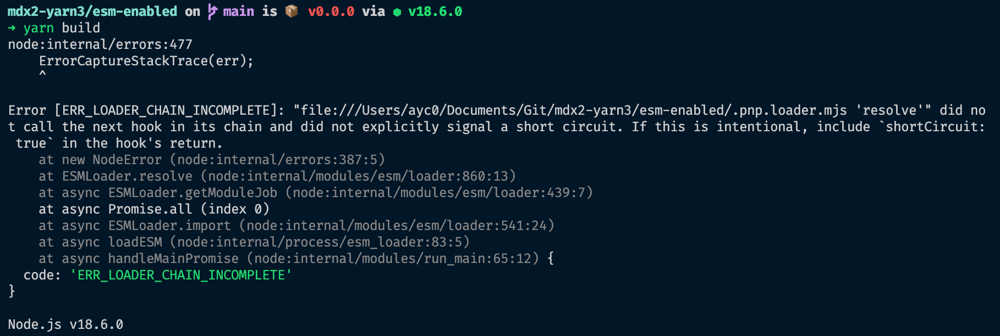

# mdx2-yarn3

This repo tries to highlight a bug with yarn and ESM (included by @mdx-js/loader)

## Node 18

### ESM disabled

When I set `pnpEnableEsmLoader: false` in `.yarnrc.yml`, I have the following error `ERR_MODULE_NOT_FOUND` with also a weird stack trace:

### ESM enabled

When I set `pnpEnableEsmLoader: true` in `.yarnrc.yml`, I have the following error `ERR_LOADER_CHAIN_INCOMPLETE`:

