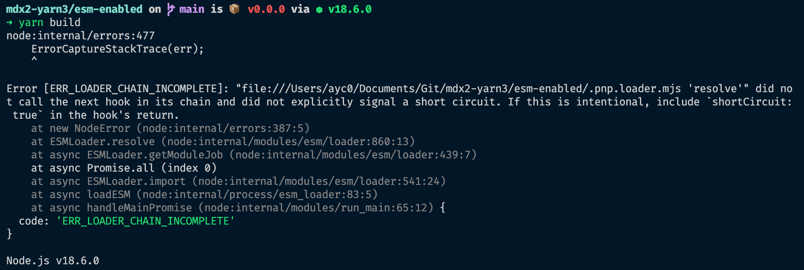
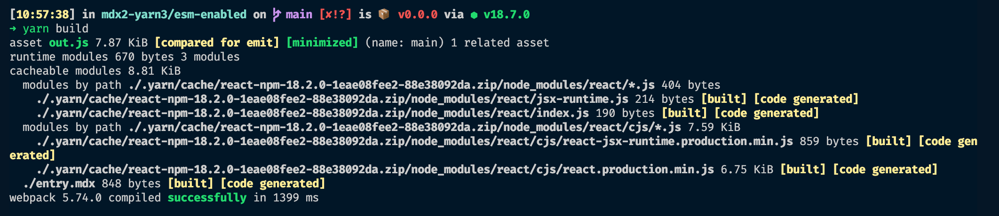
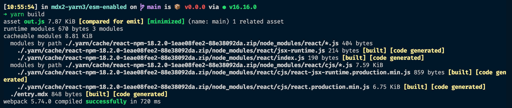

# mdx2-yarn3

This repo tries to highlight a bug with yarn and ESM (included by @mdx-js/loader)

## Node 18

### ESM disabled

When I set `pnpEnableEsmLoader: false` in `.yarnrc.yml`, I have the following error `ERR_MODULE_NOT_FOUND` with also a weird stack trace:

### ESM enabled

When I set `pnpEnableEsmLoader: true` in `.yarnrc.yml`, I have the following error `ERR_LOADER_CHAIN_INCOMPLETE`:

After upgrading yarn to the v3.2.2, it works again:

## Node 16 & ESM enabled

### Yarn v3.2.2

It compiles properly:

## Full outputs

You can check the [CI runs](https://github.com/Ayc0/mdx2-yarn3/runs/7688799378) to output in different Node/yarn versions and with ESM enabled/disabled.
